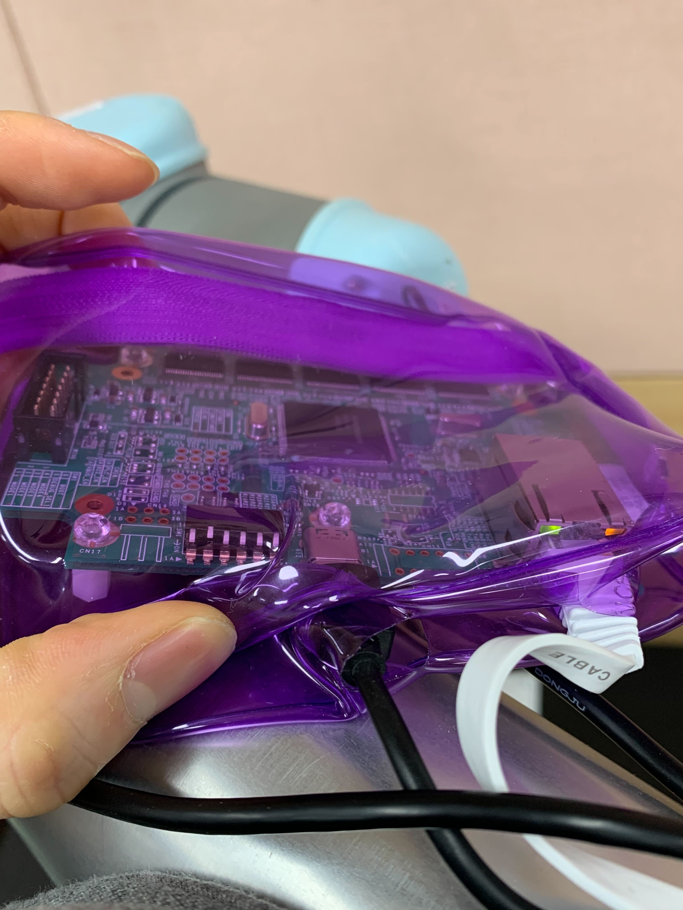
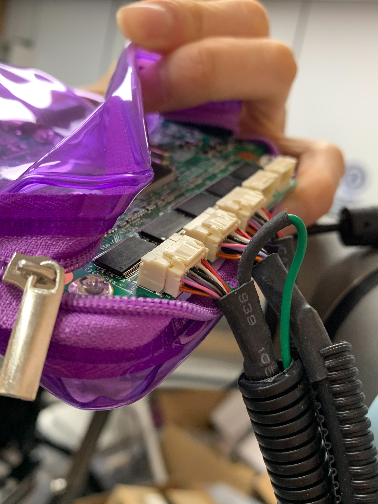

# Info
- minebea mitsumi MMS-101
- python code version 1.0.0

### 0. Requirements
```
pip install hydra
```

### 1. hardware settng 



<br>
- check
1. Check whether only pin 2 is raised.

### 2. network port setting
```
setting to network 
> address : 192.168.0.100 
> Netmask : 255.255.255.0
> Gateway : 192.168.0.1
```

``` 
for software connection (this is in config.yaml)
  dest_ip: "192.168.0.200"
  dest_port: 1366
  src_port: 2000
```

```
  ping 192.168.0.100
```

### miscellaneous
- [product info and datasheet](https://pr.minebeamitsumi.com/6axisforce/)
- [codes and CAD files](https://nmbtc.com/parts/mms101evalkit/)
